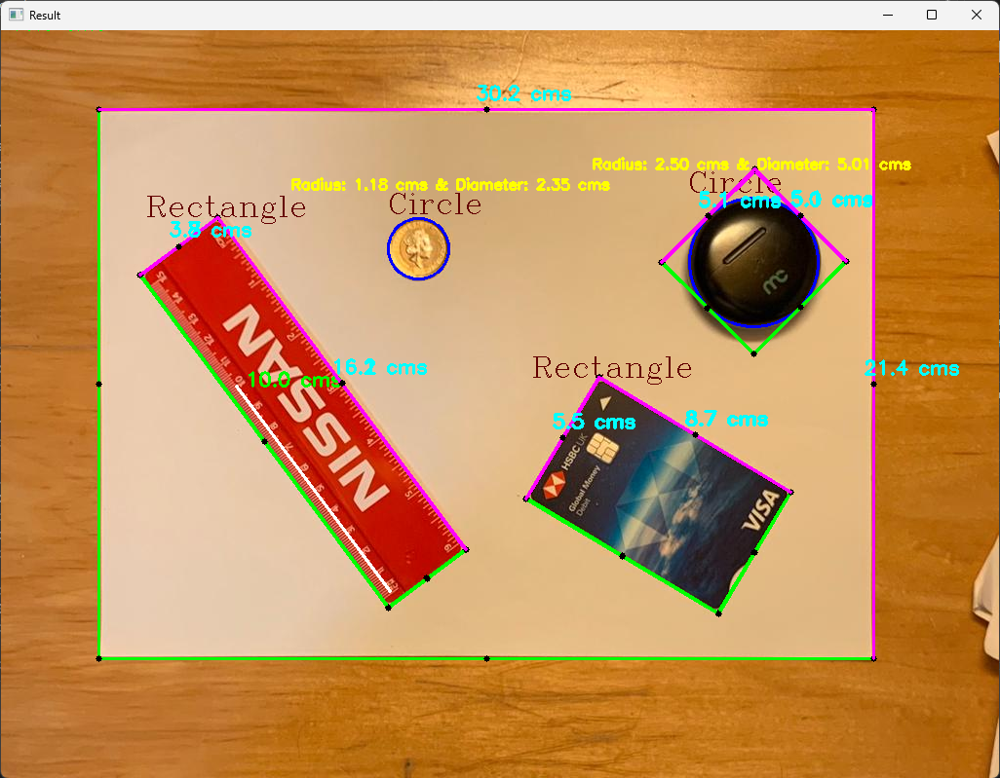

# Vision-Based-metrology-system-using-OpenCV

1. Try adding the image that needs to be measured through the "Add an Existing Item" option, if the image doesn't load or an error shows in after the Debugging, you have to manually copy and paste the particular image into the same folder as the source and solution files.

2. Make sure that the image path name matches with the actual image name (for ex. in this program Test_1.jpeg is considered).

3. Ensure that the selection points are accurate as possible.

# Results

